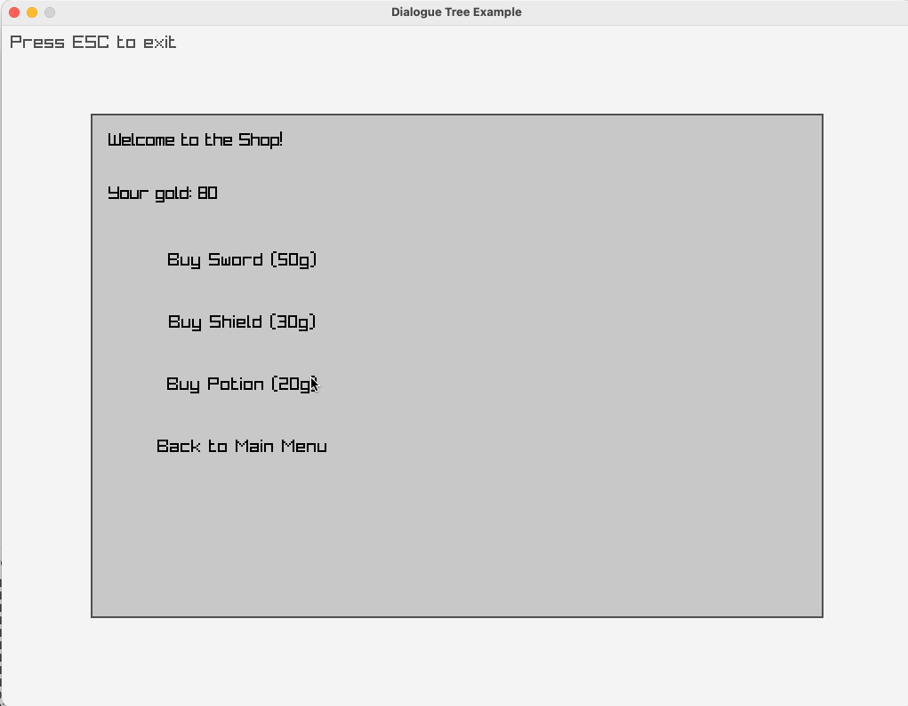

# RayDial

A component-based dialogue system and UI toolkit for [Raylib](https://www.raylib.com/).

## Features

- **Component-Based Architecture**: Easily create and manage UI components
- **Dialogue Tree System**: Build branching conversations with choice-based progression
- **Scrollable Text**: Automatic word wrapping and scrolling for text content
- **Animated Text**: Typewriter-style text animation for dialogue
- **Styled Text**: Rich text support with colors, sizes, bold, and italic formatting
- **Portrait Dialogues**: Character dialogue boxes with portraits and speaker names
- **Event-Based Interactions**: Callback system for handling user input

## Screenshots

Here are some screenshots of the examples in action:

### Basic Example


### Counter Example


### Dialogue Tree


### Animated Text


### Portrait Dialogue


### Styled Text


## Examples

The project includes several examples:

- **Basic Example**: Simple UI component usage
- **Counter Example**: Interactive button-based counter
- **Dialogue Tree**: Branching dialogue demonstration
- **Animated Text**: Text that types out with configurable speed
- **Portrait Dialogue**: Character dialogue with portrait images
- **Styled Dialogue**: Rich text formatting with colors, sizes, and styles

## Dependencies

- [Raylib](https://www.raylib.com/) 4.0+

## Building the Project

```bash
# Clone the repository
git clone https://github.com/yourusername/raydial.git
cd raydial

# Create build directory
mkdir build
cd build

# Configure and build
cmake ..
make
```

## Running Examples

After building, run the examples from the build directory:

```bash
./examples/0_basic_example
./examples/1_counter_example
./examples/2_dialogue_tree_example
./examples/3_animated_text_example
./examples/4_image_gallery_example
./examples/5_portrait_dialogue_example
./examples/6_styled_dialogue_example
```

## Usage

Here's a simple example of how to use RayDial in your project:

```c
#include "raylib.h"
#include "raydial.h"

// Callback function
void OnButtonClick(void* userData) {
    printf("Button clicked!\n");
}

int main() {
    // Initialize window
    InitWindow(800, 600, "RayDial Example");
    SetTargetFPS(60);
    
    // Create dialogue node
    RayDialNode* rootNode = CreateDialogueNode("root", "Example");
    
    // Create dialogue manager
    RayDialManager* manager = CreateDialogueManager(rootNode);
    
    // Create UI components
    RayDialComponent* panel = CreatePanel(
        (Rectangle){ 150, 100, 500, 400 },
        RAYWHITE
    );
    
    RayDialComponent* label = CreateLabel(
        (Rectangle){ 170, 120, 460, 40 },
        "Hello, RayDial!",
        true
    );
    
    RayDialComponent* button = CreateButton(
        (Rectangle){ 170, 200, 200, 50 },
        "Click Me",
        OnButtonClick,
        NULL
    );
    
    // Assemble UI
    AddComponent(panel, label);
    AddComponent(panel, button);
    rootNode->components = panel;
    
    // Main game loop
    while (!WindowShouldClose()) {
        UpdateDialogueManager(manager);
        
        BeginDrawing();
            ClearBackground(RAYWHITE);
            DrawDialogueManager(manager);
        EndDrawing();
    }
    
    // Cleanup
    FreeDialogueManager(manager);
    CloseWindow();
    return 0;
}
```

## License

This project is licensed under the MIT License - see the LICENSE file for details.

## Contributing

Contributions are welcome! Please feel free to submit a Pull Request.
